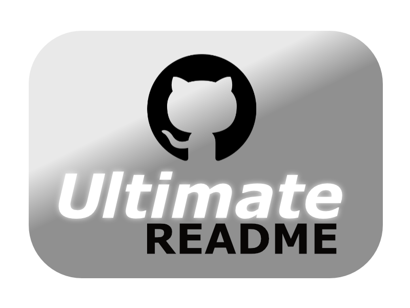

<p align="center">
    <a href="https://github.com/jotcodeofficial/ultimate-readme">
        
    </a>
 <h2 align="center">The Ultimate Readme</h2>
 <p align="center">The Ultimate Readme to use for your GitHub projects!</p>
</p>
  <p align="center">
    <a href="https://github.com/jotcodeofficial/ultimate-readme/issues">
      
    </a>
    <a href="https://github.com/jotcodeofficial/ultimate-readme/network/members">
      
    </a>
    <a href="https://github.com/jotcodeofficial/ultimate-readme/stargazers">
      
    </a>
    <a href="https://twitter.com/jotc0de">
      
    </a>
    <br />
    <br />
    <a href="https://blog.jotcode.com">
      
    </a>
    <a href="https;//jotcode.com">
      
    </a>
  </p>

  <p align="center">
    <a href="https://github.com/jotcodeofficial/ultimate-readme/issues/new/choose">Report Bug</a>
    -
    <a href="https://github.com/jotcodeofficial/ultimate-readme/issues/new/choose">Request Feature</a>
  </p>

# Index

<!-- TABLE OF CONTENTS -->
<details open="open">
  <summary>Table of Contents</summary>
  <ol>
    <li>
      <a href="#about-the-project">About The Project</a>
      <ul>
        <li><a href="#built-with">Built With</a></li>
      </ul>
    </li>
    <li>
      <a href="#getting-started">Getting Started</a>
      <ul>
        <li><a href="#prerequisites">Prerequisites</a></li>
        <li><a href="#installation">Installation</a></li>
      </ul>
    </li>
    <li><a href="#usage">Usage</a></li>
    <li><a href="#usage">Documentation</a></li>
    <li>
      <a href="#roadmap">Roadmap</a>
      <ul>
        <li><a href="#stage-1">Stage 1</a></li>
        <li><a href="#stage-2">Stage 2</a></li>
        <li><a href="#stage-3">Stage 3</a></li>
      </ul>
    </li>
    <li><a href="#contributing">Contributing</a></li>
    <li><a href="#license">License</a></li>
    <li><a href="#contact">Contact</a></li>
    <li><a href="#contact">Support the Project</a></li>
    <li><a href="#acknowledgements">Acknowledgements</a></li>
  </ol>
</details>


## About The Project

<p align="center">
    <a href="https://github.com/jotcodeofficial/ultimate-readme">
        
    </a>
 <h2 align="center">The Ultimate Readme</h2>
 <p align="center">The Ultimate Readme for your GitHub projects!</p>
</p>

So you have finished your project and the code is top notch.
But nobody seems interested? What you need is some window dressing!

You can add a README file to a repository to communicate important information about your project. A README, along with a repository license, citation file, contribution guidelines, and a code of conduct, communicates expectations for your project and helps you manage contributions.

Give your project the best chance possible by forking this repo right now! :smile:

README files typically include information on:
* What the project does
* Why the project is useful
* How users can get started with the project
* Where users can get help with your project
* Who maintains and contributes to the project

---

### Built With

In this area you can list the different libraries and technologies that your project uses.
* [Bootstrap](https://getbootstrap.com)
* [Angular](https://angular.io/)
* [Golang](https://golang.org/)


## Getting Started

In this section you can provide instructions on how to setup your project on the users machine.
You should give an introduction here before the concrete steps next.

### Prerequisites

This section should show what software is required before you can proceed with the installation.
* [Node](https://nodejs.org/)
* [MySQL](https://www.mysql.com/)


### Installation

Here you can provide the steps required to install your project on the users machine.

1. Clone the repo
   ```sh
   git clone https://github.com/jotcodeofficial/ultimate-readme.git
   ```
3. Install NPM packages
   ```sh
   npm install
   ```
4. Build the project
   ```sh
   npm build
   ```
   

## Usage

In this section you can provide examples of how the user would use your project to achieve the different desired results they may want.


## Documentation

In this section you can provide the link to where you host your documentation or wiki.
[Documentation](https://docs.example.com)


## Roadmap

Here you can provide the introduction for your projects roadmap.

### Stage 1

This will detail the first stage of your roadmap.

### Stage 2

This will detail the second stage of your roadmap.

### Stage 3

This will detail the third stage of your roadmap.


## Contributing

Great things are a sum of their parts. By contributing your time and effort you can help make this project even better. Collaborative efforts ftw.


## License

Here is where you can provide the license you are using.
Released under the MIT License.


## Contact

[@jotc0de](https://twitter.com/jotc0de)
contact@jotcode.com


## :sparkling_heart: Support the Project

If you are not a coder you can still help support the project by sharing it far and wide.
Thanks! :heart:


## Acknowledgements

I would like to acknowledge the following projects for inspiration:

https://github.com/othneildrew/Best-README-Template
https://github.com/anuraghazra/github-readme-stats


